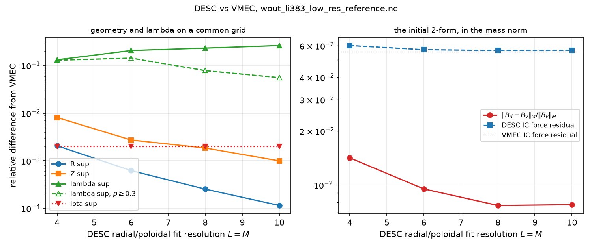
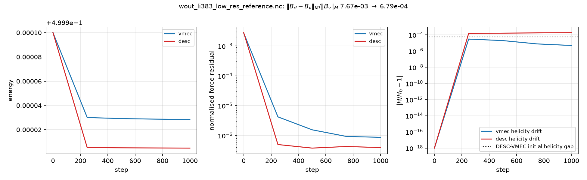
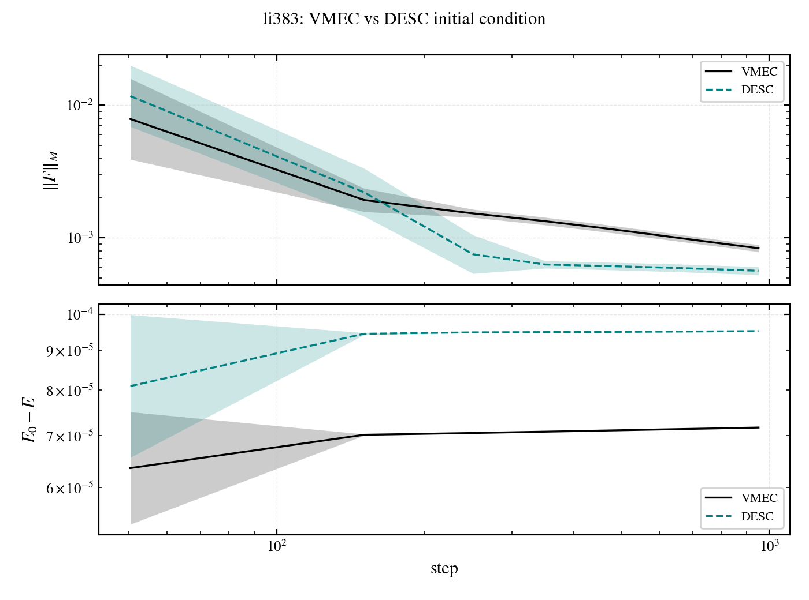
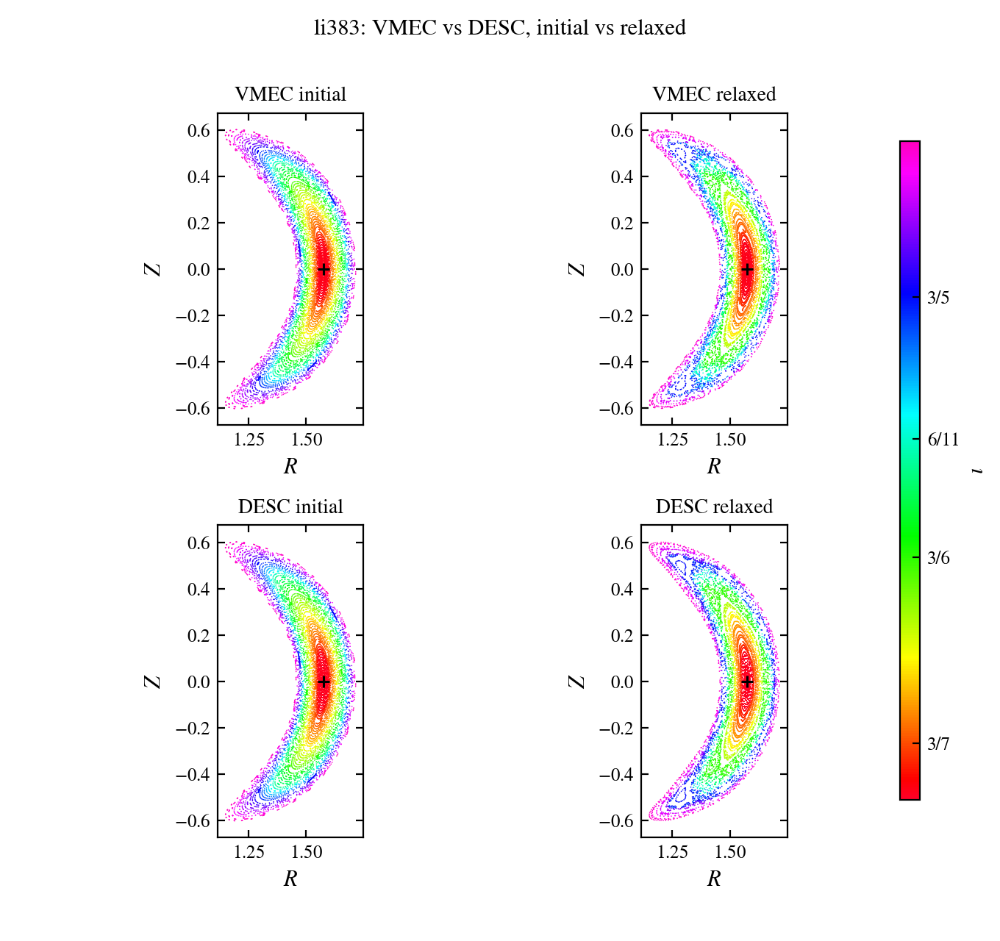
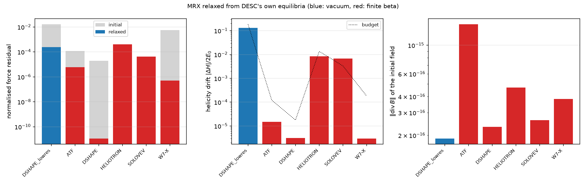
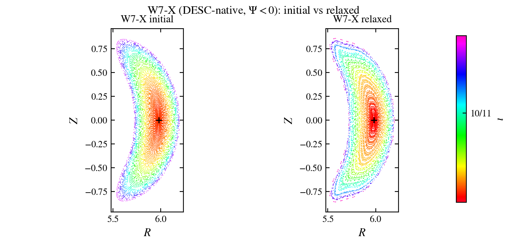
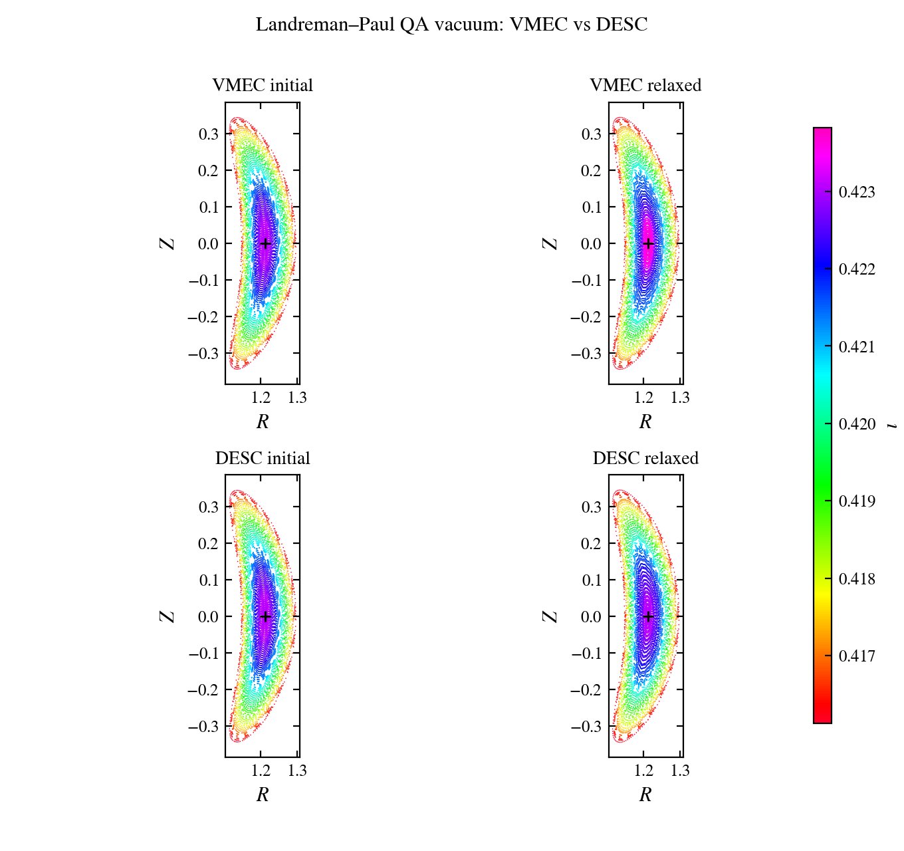

# DESC → MRX interface (2026-09-13)

Status: complete and merged into `desc-interface-v2`; `mrx/desc.py` reads a
DESC `.h5` with `h5py` alone and the three validation layers below all pass.
Read it for: the measured DESC-vs-VMEC differences on li383, the converged
comparison, the sweep over DESC's own equilibria, and two DESC-side
conventions that cost time (the poloidal flip, the lambda half-mesh bug).
Do not read it for: how the interface works — that is
`docs/source/concepts/external_interfaces.md`, which this record backs.

Branch `desc-interface-v2` off `static-dynamic-refactor` (`b0f8d38`), in the
worktree `/Users/aak572/mrx-desc`. All numbers below are float64 on the
local machine, `mrx` conda env, no DESC installed — the reader needs only
`h5py`, `numpy`, `scipy`. DESC 0.17.2 (source checkout, `consulting` env)
was used once, to generate the fixtures; Torch's `mrx.ext3` overlay carries
the same 0.17.2.

## 1. What was built

`mrx/desc.py`, modelled on `mrx/vmec.py`: `read_desc`, `read_nfp`,
`profile_spline`, plus `flip_poloidal_angle` and `match_orientation` (§4).
It converts DESC's Fourier-Zernike series into the block dict that
`mrx/gvec.py` produces, so `build_gvec_map`, `series_spline_dofs`,
`StateField` and `initial_field` are untouched. Wiring is six dispatch
extensions plus `scripts/relax.py`'s `--geometry`.

The conversion is product-to-sum: DESC evaluates a product of two real trig
factors, MRX a single trig of the combined angle, so each DESC mode becomes
the MRX pair `(m, +n nfp)` and `(m, -n nfp)` at half weight, one at full
weight when `n = 0`. Radially, each mode's Zernike sum is sampled and refit
through `mrx.vmec._fit_block`. Full derivation in the concepts page.

## 2. DESC against VMEC on a common grid (`scripts/desc_vmec_grid.py`)

Both states from the *same* wout (`data/wout_li383_low_res_reference.nc`,
nfp=3, finite beta), DESC's side via `VMECIO.load(..., profile="iota")` at
four fit resolutions. This isolates DESC's fit error plus our conversion
from every other difference. Grid `(40, 64, 32)`, relative sup norms:

| fit `L,M,N` | R | Z | lambda | lambda, `rho>0.3` | iota | `B` |
|---|---|---|---|---|---|---|
| 4,4,3   | 2.07e-3 | 8.12e-3 | 1.32e-1 | 1.30e-1 | 2.00e-3 | 1.42e-2 |
| 6,6,3   | 6.22e-4 | 2.73e-3 | 2.08e-1 | 1.44e-1 | 2.00e-3 | 9.49e-3 |
| 8,8,3   | 2.54e-4 | 1.86e-3 | 2.33e-1 | 7.84e-2 | 2.00e-3 | 7.67e-3 |
| 10,10,3 | 1.15e-4 | 9.96e-4 | 2.64e-1 | 5.59e-2 | 2.00e-3 | 7.74e-3 |

R and Z converge cleanly toward the VMEC reference, a factor 18 and 8 over
the sweep — that is the headline, and it is what says the conversion is
right rather than merely self-consistent. iota sits at 2e-3 flat: it is a
profile, resolved at every rung, and 2e-3 is `VMECIO`'s own spline fit of
`iotaf`, independent of `L,M,N` as it should be.

The initial 2-form from each is sound on both sides: `div` at 1.4e-15,
`wall_discarded` below 2.6e-8, toroidal flux matching to 2.3e-5 relative,
force residuals 0.0564 (DESC) against 0.0553 (VMEC) at the coarsest rung
they share. `B` differs by 7.7e-3, and does not fall below that — which is
lambda's doing:

**Lambda does not converge, and the cause is in DESC.**
`fourier_to_zernike` fits `lmns` at `rho = sqrt(linspace(0, 1, ns))`, but
`lmns` in a wout is on the **half mesh** with a dummy zero first row. The
fit is misregistered by half a radial cell and pinned to zero on the axis
where VMEC's lambda is not zero. Raising `L,M,N` tracks the wrong nodes
more faithfully, so the sup error *grows* (1.3e-1 to 2.6e-1) while
everything else falls. Restricting to `rho > 0.3` recovers convergence
(1.30e-1 to 5.59e-2), which localises it to the axis and confirms the
diagnosis. MRX's own wout reader handles the half mesh correctly
(`mrx.vmec._lambda_nodes`). Not worked around; the scripts report
`lambda_outer` alongside `lambda` so the artefact cannot be mistaken for
ours.

## 3. Converged from a VMEC versus a DESC initial condition (`scripts/desc_vmec_relax.py`)

One sequence `(8, 12, 12)` p=2, one `TimeStepper`, two initial fields,
1000 steps each, li383.

| | initial | final |
|---|---|---|
| `\|B_d - B_v\|_M / \|B_v\|_M` | 7.67e-3 | **6.79e-4** |

The difference **shrinks by 11x** through relaxation — amplification 0.088.
This is the result that matters most. MRX relaxation is a
helicity-preserving energy minimisation, so two initial conditions carrying
different helicity need not reach the same state, and the honest assertion
is only that the discrepancy is not amplified. It is in fact strongly
contracted: the two initial fields differ by 7.67e-3 while their helicities
differ by 5.70e-5, and the converged states settle a factor 11 closer,
consistent with the fixed point depending on helicity rather than on the
representation that delivered it.

Both runs are well-behaved and agree on the physics: energy monotone
throughout, force residual 5.53e-2 to 9.35e-4 (VMEC) and 5.64e-2 to 6.31e-4
(DESC), helicity drift 2.5e-8 and 9.5e-7 of `2 E_0`, final energies within
4.7e-5 relative, `beta_vol` 0.042572 against 0.042574 (4.0e-5 relative) —
each converging to it from its own initial 0.0459 and 0.0462. `JoverB`
agrees to 7.6e-3 and `JB` to 5.1e-3.

The per-step traces, block-averaged the house way, say the same thing at
1000 samples rather than five chunk boundaries: both residuals drop, DESC
ends slightly lower, and most of the energy comes out in the first hundred
steps.

The Poincaré sections make the 11x contraction visible. All four panels
are nested, the two initial conditions already agree at the eye, and
relaxation does not open an island or scramble the surfaces.

## 4. The poloidal flip, which is the trap

`VMECIO.load` runs `ensure_positive_jacobian`, which for a left-handed wout
— li383 among them — negates theta: `m < 0` modes of R and Z, `m >= 0`
modes of lambda, and iota. The first grid run reported an iota difference
of exactly 2.000 relative, i.e. a clean sign flip, which is what exposed it.

MRX does not need this undone to *read* a file: `build_gvec_map` measures
the handedness giving `det DF > 0`. But comparing at equal theta compares
different points. `match_orientation` measures the relative orientation and
`flip_poloidal_angle` undoes it in the block representation. Every run
above reports `orientation = -1`, and after matching, iota agrees to 2e-3
rather than differing by a factor 2.

One subtlety cost a test: orientation must be measured from **R and Z
together**. On an up-down-symmetric cross-section R alone is blind to the
flip, and the synthetic circular torus is exactly that case.

## 5. Sweep over DESC's own saved equilibria (`scripts/desc_example_sweep.py`)

Relaxing MRX from DESC's shipped `_output.h5` files directly, `(8, 14, 8)`
p=2, 500 steps. Six iota-constrained cases run without DESC installed; the
current-constrained ones (NCSX, ARIES-CS, precise_QA, HSX, WISTELL-A) need
DESC for iota and are Torch-only.

| case | nfp | vac | iota axis file/MRX | div | F in → out | dH/2E0 | reader | relax |
|---|---|---|---|---|---|---|---|---|
| DSHAPE_lowres | 1 | y | 1.00000/1.00000 | 1.9e-16 | 1.64e-2 → 2.38e-4 | 1.30e-1 | ok | ok |
| ATF | 12 | n | 0.35000/0.35000 | 1.5e-15 | 1.16e-4 → 5.94e-6 | 1.50e-5 | ok | ok |
| DSHAPE | 1 | n | 1.00000/1.00000 | 2.3e-16 | 1.92e-5 → 1.15e-11 | 3.12e-6 | ok | ok |
| HELIOTRON | 19 | n | 1.00000/1.00001 | 4.7e-16 | 5.61e-5 → 3.94e-4 | 8.40e-3 | ok | ok |
| SOLOVEV | 1 | n | 1.00000/1.00000 | 2.6e-16 | 6.40e-7 → 4.17e-5 | 6.75e-3 | ok | noted |
| W7-X | 5 | n | 0.85605/0.85605 | 3.8e-16 | 5.69e-3 → 5.02e-7 | 3.0e-6 | ok | ok |

**The reader checks pass on all six** — iota matched to the file's own
profile at both axis and edge to 5-6 digits, `div` at round-off,
`wall_discarded` negligible, initial field finite. That includes nfp=19
(HELIOTRON) and nfp=12 (ATF), which stress the toroidal mode mapping
hardest, and W7-X with `Psi = -2.133`, which exercises the negative-flux
branch. This is the broad validation the sweep exists for.

The two columns are deliberately separate. Reader checks are properties of
the *file as read* and must pass. Relaxation checks are properties of the
*run* at a resolution chosen for cost, and a failure there is information
about MRX or about the case, not about the reader. Conflating them would
have let a real reader bug hide behind a plausible relaxation excuse.

SOLOVEV is `noted`, and correctly. It starts at a force residual of 6.4e-7
— already force-balanced to well below what `(8, 14, 8)` can resolve — so
there is nothing to minimise and the run wanders at its own floor, rising
to 4.2e-5. Its helicity drift is 6.75e-3 against a budget of 3.32e-3: a
drift that is genuinely large as a fraction of an energy release that is
essentially zero. The budget combines a round-off floor growing with step
count with a term proportional to fractional energy released; for a case
that releases nothing, the second term vanishes and any wandering exceeds
it. The right reading is that SOLOVEV at this resolution has no relaxation
to do, not that the relaxation is wrong.

Two of the cases also have Poincaré sections. W7-X is DESC-native, nfp=5,
`Psi = -2.133`: nested at the initial field and still nested after 1000
steps, so the negative-flux branch traces as a stellarator rather than a
mirrored mess.

Landreman–Paul QA is the vacuum check, and it is the consumer of the
tracked `data/desc_QA_lowres.h5` fixture. A vacuum equilibrium has a known
answer; VMEC and DESC start and finish on the same nested surfaces.

## 6. Tests

`test/test_desc.py`, 26 collected tests (23 pass with no DESC installed;
the three live-DESC items skip). The two that carry the most weight:

- `test/synthetic_desc.py` writes a closed-form DESC-layout file that
  inverts `read_desc`, and describes the **same torus** as
  `test/synthetic_gvec.py`, so the two readers are held against each other
  through independent parsers of independent formats.
- the tracked fixtures are checked against their Fourier-Zernike series
  rebuilt in DESC's own product form, independent of the conversion under
  test.

Plus product-to-sum on a two-mode field, Zernike radials against explicit
low-order polynomials, negative `Psi`, the `_sym = False` and current-
constrained guards, dispatch through `geometry_kind` / `geometry_nfp` /
`initial_field`, and `flip_poloidal_angle` as an involution.

## 7. Verification

`ruff check . --ignore F403,F405` clean. Locally (`mrx` conda env, jax
0.10.2, no DESC): **77 passed, 3 skipped**, the skips being the live-DESC
items. On Torch in the `mrx.ext3` overlay with DESC 0.17.2, one H200:
**80 passed, nothing skipped** — the live cross-check against `eq.compute`
and the current-constrained iota path both run there. `mrx.desc` coverage
on that node is **100%**. Figures regenerate from cache with
`python -u scripts/desc_figures.py --figure all`.

Two things worth knowing for anyone repeating this:

- **pytest is not in the overlay** and the overlay is read-only; it was
  installed with `pip install --target /scratch/aak572/pytest-libs` and put
  on `PYTHONPATH`, leaving the overlay untouched.
- **The overlay's jax 0.8.1 cannot take `batch_size=0`.** MRX's default
  `MAP_BATCH_SIZE_INNER = 0` means "one `vmap`". That is a documented
  jax contract as of [jax#33965](https://github.com/jax-ml/jax/pull/33965),
  first released in **0.8.2** (2025-12-18); `pyproject.toml` now pins
  `jax>=0.8.2`. The overlay predates the fix (0.8.1, 2025-11-18) and is
  read-only, so the Torch runner still sets `MAP_BATCH_SIZE_INNER = 4096`
  from outside the repo. This is a version floor, not an MRX bug.

The suite must run on a **compute node**: on the login node the sequence
build in the dispatch test had not finished after 50 minutes, against 56 s
on an H200.

## 8. Open

- **Current-constrained files are Torch-only.** Structural: iota is not in
  the file. The DESC-backed path works; CI cannot exercise it.
- **DESC's wout lambda half-mesh bug (§2).** Recorded, not worked around.
  Worth a DESC issue; it makes any lambda comparison through `VMECIO.load`
  misleading near the axis for everyone, not just MRX.
- **The sweep is local, at `(8, 14, 8)`.** The Torch runs at production
  resolution, and the current-constrained cases, have not been done.
