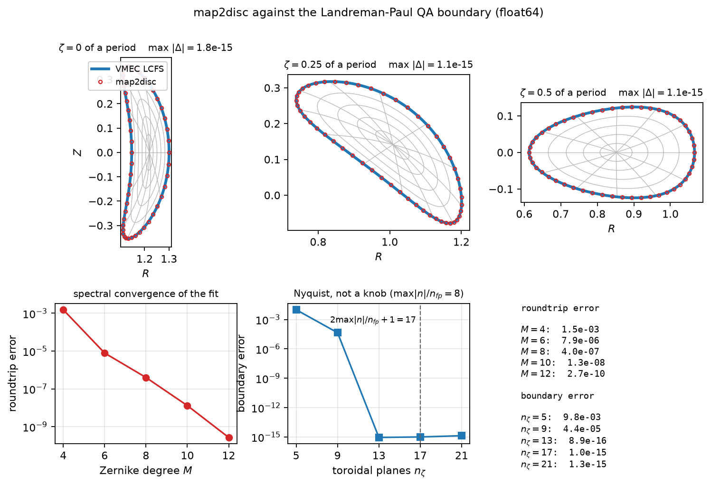
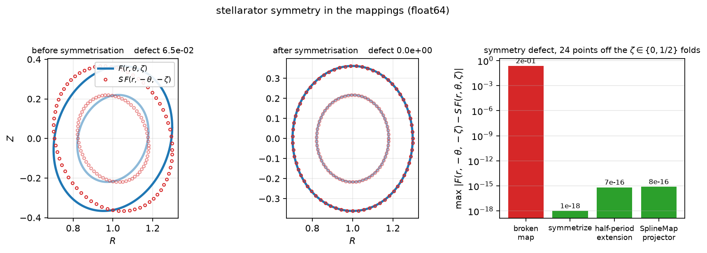
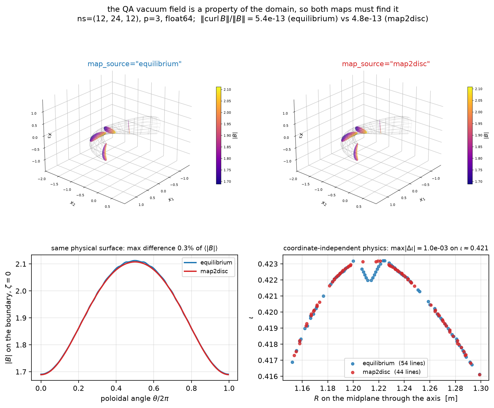
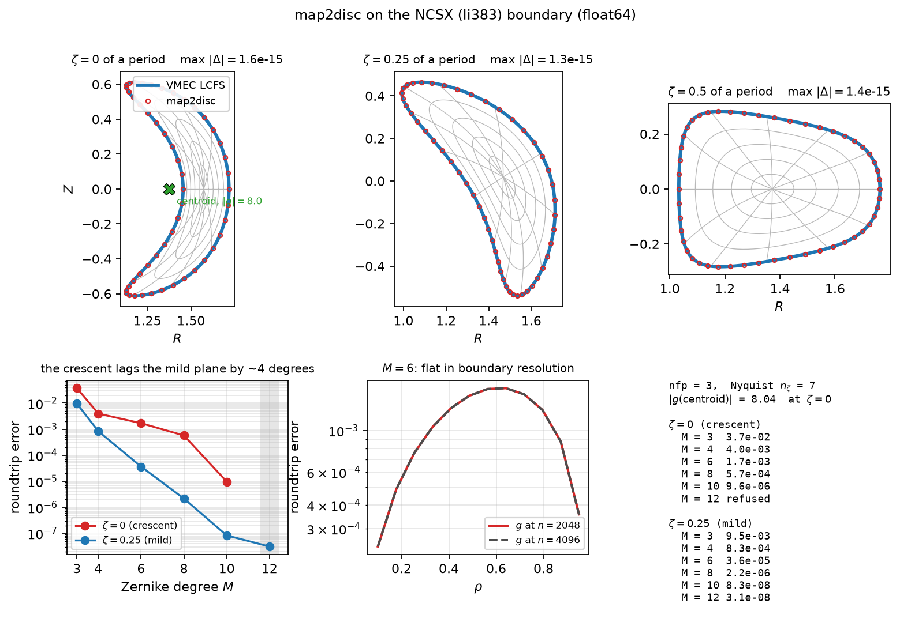
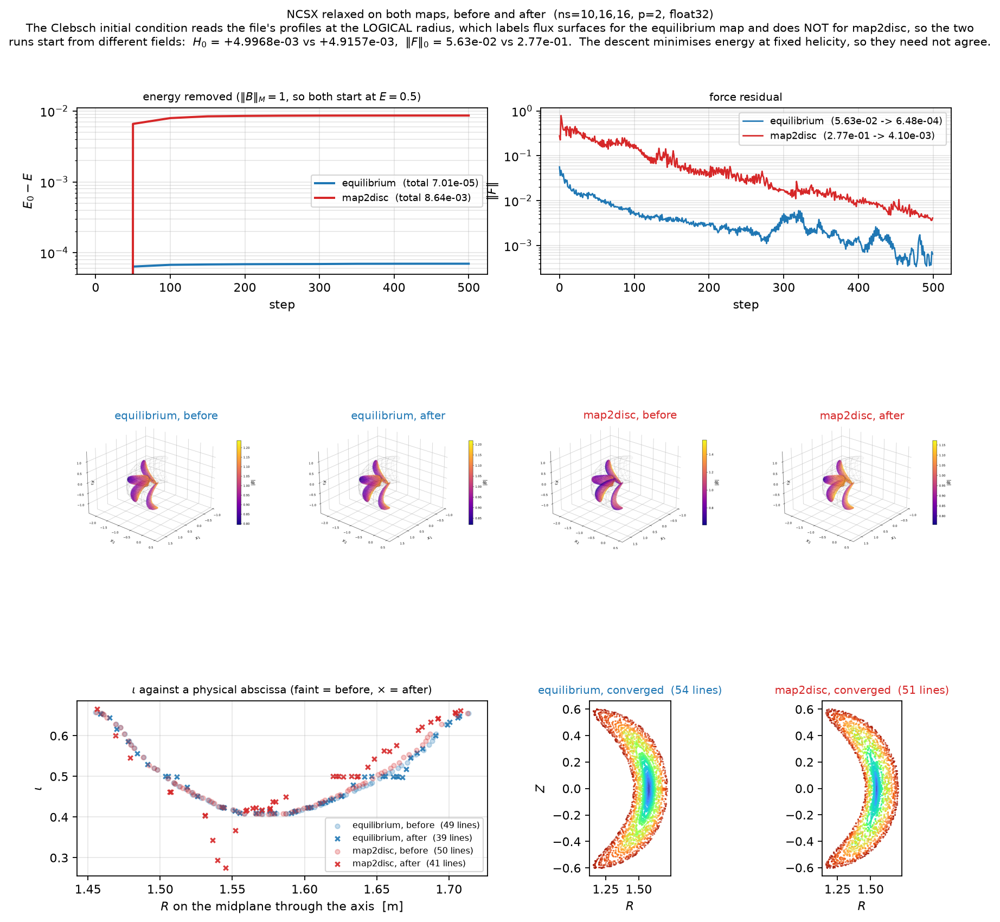

> **Status:** current (2026-09-13)
> **Read this for:** what the native map2disc implementation gets right and wrong, the two resolution laws that govern it, why the Newton is warm-started by degree continuation and seeded from the harmonic map itself, and the evidence that a map2disc map of the Landreman-Paul QA and NCSX boundaries carries the same physics as the map built from each file's own interior.
> **Do not read for:** the algorithm itself (the module docstring of `mrx/map2disc.py` and the paper), or the stellarator-symmetry API (the docstrings in `mrx/mappings.py`).

# map2disc: audit, resolution laws, and a physics-level check against VMEC -- 2026-09-13

`mrx/map2disc.py` implements Babin, Hindenlang, Maj and Koeberl, *Construction
of an invertible mapping to boundary conforming coordinates for arbitrarily
shaped toroidal domains*, PPCF **67** 035005 (2025), natively in JAX, with no
dependency on the authors' `map2disc` or on `pyBIE2D`: two Dirichlet-Laplace
problems solved by a periodic trapezoidal Nystrom discretisation of the
double-layer operator, and the inverse fitted in a Zernike basis.

Sections 1-6 are measured against `data/wout_LandremanPaul2021_QA_lowres.nc`
and sections 7-9 against `data/wout_li383_low_res_reference.nc` (NCSX), in
`MRX_DTYPE=float64` unless stated. Figures are regenerated by
`scripts/map2disc_figures.py --figure all`.

## 1. What the first implementation got wrong

Found by running the method on a real boundary instead of an ellipse.

### The near-boundary blend destroyed convergence

`fit_disc_map` inverted every concentric node above `rho_safe = 0.85` at
`rho_safe` and blended it linearly out to the wall -- 50 of the 136 nodes at
the then-default `M = 15`. That wrong data then went into a *square, exact*
interpolation solve, so it spread over the whole disc. Roundtrip error on a
non-convex bean at `M = 10`:

| `n_boundary` | with blend | without |
| --- | --- | --- |
| 256 | 2.31e-03 | 6.01e-04 |
| 1024 | 2.31e-03 | 9.35e-08 |
| 2048 | 2.31e-03 | 9.35e-08 |

The blend pinned the error at 2.3e-03 for *any* degree and *any* boundary
resolution. It survived because **every accuracy oracle in the test file was a
circle or an ellipse, and the inverse map is linear in `rho` for an ellipse**,
which makes a linear blend exact there (measured 4.34e-15). The suite had no
power to detect it.

### At the shipped defaults the QA map was simply wrong

With the blend gone the accuracy is set by the boundary resolution, and the
governing quantity is how far the closest interior node sits from the wall in
boundary spacings. At `M = 15, n_boundary = 256` the QA cross-section at
`zeta = 0.25` came out with a **boundary error of 2.34 and `det DF` spanning
+/-3e31** -- a map that still looks like a map.

### Smaller defects

- `jacobian_determinant(0, theta)` returned **NaN**: `hypot`/`atan2` at the
  origin, which is the axis of every MRX map. Zernike modes now also evaluate
  as polynomials in the Cartesian disc coordinates, smooth there, which also
  replaced a per-mode Python trace loop.
- `boundary_from_samples` documented counterclockwise but never checked it. A
  reversed curve silently returned a wrong map (`g(0.3, 0.1) = (-0.15, 0.04)`
  instead of `(0.3, 0.2)`). Now a shoelace guard.
- `invert_harmonic_map(tol=...)` and `map2disc_map(n_boundary=...)` were both
  dead parameters. The first now returns its residual, the second resamples.
- `map2disc_map`'s hardcoded `-R sin` is a `sign` parameter, and
  `map2disc_from_equilibrium` measures the handedness rather than assuming it.

Verified correct and unchanged: the double-layer row-sum diagonal, the Nyquist
handling in the FFT derivative and interpolation helpers, and trigonometric
upsampling (256 -> 2048 exact to 8.9e-16).

## 2. The two resolution laws

**Spectral in the Zernike degree, once the blend is gone.** The QA plane
converges 1.5e-03 at `M = 4`, 7.9e-06 at 6, 4.0e-07 at 8, 1.3e-08 at 10,
2.7e-10 at 12. `M` must also be at least the boundary's own poloidal mode
number or the exact `rho = 1` ring aliases (1.5e-04 at `M = 4`, 1.3e-15 at
`M >= 6`). The default is 8. `M = 15` is unreachable in practice -- it needs
around 8192 boundary samples.

**`n_zeta` is a Nyquist condition, not a convergence knob.** A cross-section
whose largest toroidal mode per field period is `n_max` needs
`n_zeta >= 2 n_max + 1`. QA runs to `max|n| / nfp = 8`, so the old default of 8
planes *aliased* it: boundary error 9.8e-03 at `n_zeta = 5` and 4.4e-05 at 9,
falling to 1.0e-15 by 13 and staying there. `nyquist_n_zeta` computes the bound
(17 for this file) from the file; the default is 16.

**The boundary resolution is the real budget.** The Nystrom evaluation of `g`
degrades as the target approaches the wall, and the outermost interior ring
sits at `cos(pi / M)`, which crowds the wall as `M` grows. `fit_disc_map`
therefore refines the boundary itself, trigonometrically (exact for the finite
Fourier cross-section of an equilibrium file), and accepts a resolution only
when the closest node is `GAP_RATIO = 6` spacings clear of the wall *and* the
nodes have stopped moving under refinement. The Newton residual alone certifies
nothing: it says the iteration solved `g_quadrature(x) = target`, not that
`g_quadrature` is `g`.

## 3. Degree continuation in the Newton start

**Question:** should the fit be warm-started from a solution at lower `M`?

**Answer: yes, and it is now the default**, but for robustness, not accuracy.

From the crude radial guess `c + 0.9 rho (gamma(theta) - c)` the Newton already
converges quadratically on anything mild -- iterations to a residual of 1e-12,
at `M = 8`:

| cross-section | crude start | warm from `M - 1` |
| --- | --- | --- |
| ellipse 1:4 | 1 | 0 |
| bean | 4 | 2 |
| severe bean | 5 | 2 |
| QA `zeta = 0` | 4 | 1 |
| QA `zeta = 0.25` | 3 | 2 |

So continuation buys nothing on the cases the method is usually asked for. It
matters at the edge of the shape envelope. On a severe bean
(`r = 1 + k cos a + 0.5 k cos 2a` at `k = 0.85`, aspect ratio 6.3) the crude
start lands where the Nystrom evaluation is meaningless and Newton walks out of
the domain to order **1e15**. Maximum node error against a converged
`n = 16384` reference:

| `n_boundary` | crude start | degree continuation |
| --- | --- | --- |
| 2048 | diverges (residual 9.24e-01) | 1.6e-14 |
| 4096 | 1.5e-14 | 1.4e-14 |

Continuation reaches the same nodes **one boundary doubling earlier**. That is
the whole argument for it: the rungs `d = 2, 3, ..., M` share the single dense
Nystrom solve inside `harmonic_map`, so at `n = 2048` seven rungs cost about
0.7 s against 0.38 s to build the matrix and 0.33 s to factor it -- while a
doubling costs eight times that. It is the cheap way to avoid the expensive
thing.

### Continuation in the boundary's Fourier content is harmful

The other reading of "Fourier continuation" -- homotopy in the *shape*, adding
boundary harmonics gradually and warm-starting each step -- was measured and is
worse than doing nothing. At fixed `n = 2048`, warm-starting the `k = 0.5` bean
from the converged `k = 0.3` solution gives a Newton residual of **9.2e-01**,
where the crude start on the same curve gives 1.2e-15. The previous shape's
nodes sit in the region where the *new* shape's quadrature is inaccurate, so
the warm start is actively worse than a guess that at least scales with the new
boundary. Degree continuation does not have this problem because the boundary,
and therefore `g`, is fixed across the ladder.

## 4. A correct fit was being rejected

The same severe bean exposed a defect in the refinement loop itself. The
acceptance test compares each resolution against the previous one, and the
previous one was used unconditionally. At `k = 0.85` the `n = 2048` level
diverged, so the `n = 4096` level -- right to 1.4e-14 -- measured a movement of
**1.47e15** against it, escalated to the `n_max = 4096` cap and raised.

The comparison now only uses a level whose Newton *converged*. A level that is
merely gap-short is still a valid predecessor: its nodes are inaccurate, not
wrong, and the gap is tested on the current level anyway. Requiring the
predecessor to be gap-resolved as well is the obvious alternative and it costs
a further doubling, which puts this fit past `n_max`. With the loop fixed and
continuation in place the severe bean fits at `M = 8` inside the default cap,
`det DF` in [5.9e-02, 5.7e+00], boundary reproduced to 2.4e-15.

## 5. Stellarator symmetry

`stellarator_symmetrize` projects a map onto
`(F(r, t, z) + S F(r, -t, -z)) / 2` with `S = diag(1, -1, -1)`, the reflection
induced on the GVEC convention `(R cos 2 pi zeta, -R sin 2 pi zeta, Z)` by the
physical symmetry `(R, phi, Z) -> (R, -phi, -Z)`. Note that this convention is
left-handed, so a one-field-period shift is a **negative** z-rotation.

On a rotating ellipse given a `Z` term that is even where it must be odd, the
defect `max |F(r, -t, -z) - S F(r, t, z)|` is 2e-01. All three routes to a
symmetric map remove it to roundoff: the projector (1e-18), the half-period
extension (7e-16), and the `SplineMap(stellarator_symmetric=True)` flag, which
applies the projector as an index permutation on the two uniform periodic
angular axes (8e-16).

One caveat worth recording: `extend_map_half_period` returns `F_half`'s own
value exactly *on* the fold lines `zeta = 0` and `zeta = 1/2`, so the extended
map carries the input's defect there and nowhere else. The probe points in the
figure avoid those two lines. It also assumes the input is 1-periodic in the
logical `zeta`, which `rotating_ellipse_map(nfp > 1)` is not.

## 6. The physics check: the QA vacuum field on both maps

Geometry agreement is not the interesting claim -- map2disc reproduces the LCFS
to 1.3e-15 by construction, where the spline projection of `build_gvec_map`
carries its own discretisation error there (4.9e-03 at `ns = (6, 8, 8)`,
8.6e-04 at `(8, 12, 12)`). *Inside*, the two maps disagree on purpose:
map2disc's surfaces are level sets of a harmonic map, not the equilibrium's
flux surfaces. So the question is whether a map whose interior is invented
still carries the right physics.

The vacuum field answers it. Inside a perfectly conducting wall the curl-free,
divergence-free field with `B . n = 0` and one unit of toroidal flux is the
harmonic 2-form of the Dirichlet de Rham complex -- **a property of the domain,
not of the coordinates used to mesh it**. QA is a vacuum equilibrium, so
solving for it on the two maps of the same boundary must give the same physical
field. At `ns = (12, 24, 12)`, `p = 3`, float64:

| | `map_source="equilibrium"` | `map_source="map2disc"` |
| --- | --- | --- |
| `\|\|div B\|\|` | 1.10e-15 | 1.08e-15 |
| `\|\|curl B\|\| / \|\|B\|\|` | 5.40e-13 | 4.79e-13 |
| Rayleigh quotient | 2.68e-25 | 2.12e-25 |

Both find an essentially exactly harmonic field. Comparing them:

- `|B|` on the boundary at `zeta = 0` -- the one surface where the two maps
  agree pointwise, so this needs no inversion -- differs by **0.3% of the mean**.
- The rotational transform against `R` on the midplane through the magnetic
  axis, which is a property of the physical curve and therefore comparable
  across maps, differs by **1.0e-03 on `iota` around 0.421**, about 0.24%. The
  difference is concentrated near the axis, where the two sets of traced lines
  do not cover the same range of `R` and the comparison interpolates across a
  gap; over the outer two thirds the two profiles sit on top of each other.

That is a discretisation-level difference on two genuinely different meshes of
the same domain, which is the expected answer and the one that matters:
map2disc needs only a boundary, and its Jacobian is checked rather than hoped
for.

## 7. The interior seed: map2disc diverged on all of NCSX

QA is a bean. NCSX (`data/wout_li383_low_res_reference.nc`) is a **crescent**,
and on it `fit_disc_map` failed at every degree from `M = 3` to `M = 8`, in
both precisions, at every resolution up to the `n_max = 4096` cap. Per plane
at `M = 4`:

| `zeta` | Newton residual | `\|g(centroid)\|` |
| --- | --- | --- |
| 0 | 7.07e-01 | 8.04 |
| 0.0625 | 9.24e-01 | 7.82 |
| 0.125 | 8.66e-01 | 7.09 |
| 0.25 | 1.7e-15 | 0.52 |
| 0.5 | 1.7e-15 | 0.01 |

7.07e-01 is exactly `cos(pi / 4)`, the target radius: `g(x) -> 0` because the
nodes had fled to about 1e12.

The curves were clean -- positive area, no self-intersection, no pinching,
`cond(D) ~ 8`. The fault was the Newton start. `_invert_nodes` anchored every
node at the boundary sample centroid, `c + 0.9 rho (gamma(theta) - c)`, which
assumes the domain is **star-shaped about the centroid**. A crescent's centroid
is not even inside the plasma: `g` maps the interior onto the unit disc, so
`|g| <= 1` is an exact interior test, and the `zeta = 0` centroid measures
**8.04**. Moving the anchor to the pole of inaccessibility does not rescue it
either (still 9.24e-01) -- a crescent is not star-shaped about any point, so no
single anchor exists.

`_interior_seed` replaces it with a nearest-neighbour lookup against a coarse
`48 x 48` evaluation of `g` over the boundary's bounding box, keeping only
candidates with `|g| <= 1` and taking, for each target, the one whose image is
closest. No point-in-polygon test is needed, because `g` supplies the interior
test itself. Only the first continuation rung uses it; the rest still start
from the previous rung's `ZernikeMap`. All five probed planes then converge to
2e-15 with `det DF(0) > 0`, and the seed costs about 0.1 s against the `O(n^3)`
Nystrom solve it precedes.

## 8. NCSX: the mesh

The `rho = 1` ring is exact: li383's poloidal content runs only to `m = 3`, so
`M = 6` reproduces the wout's LCFS to 1.6e-15 on all three planes. Its
**interior** converges, but about four degrees behind the mild plane of the
same file. Roundtrip error at `rho` in `{0.3, 0.6, 0.9}`:

| `M` | `zeta = 0` (crescent) | `zeta = 0.25` (mild) |
| --- | --- | --- |
| 3 | 3.7e-02 | 9.5e-03 |
| 4 | 4.0e-03 | 8.3e-04 |
| 6 | 1.7e-03 | 3.6e-05 |
| 8 | 5.7e-04 | 2.2e-06 |
| 10 | 9.6e-06 | 8.3e-08 |
| 12 | refused | 3.1e-08 |

So it is the crescent and not the file, and the crescent is usable -- 9.6e-06
at `M = 10`. Two things are worth recording. First, the rate is uneven
(7x from `M = 4` to 8, then 59x from 8 to 10) because `fit_disc_map` refines
the boundary in doublings, so neighbouring degrees can land on different
`n_boundary`. Second, what limits it is **Zernike truncation**, not the close
evaluation near the wall that governs everything in section 2. Two
measurements say so:

- the error is identical to every digit against `g` at `n = 2048` and at
  `n = 4096`, so the boundary quadrature is not in play;
- it peaks well inside, at `rho ~ 0.65` (5.8e-04 at `M = 8`, 47 boundary
  spacings from the wall), and falls towards both the axis (6.0e-05) and the
  wall (2.7e-04). A close-evaluation error would grow monotonically outwards.

"Refused" is `fit_disc_map` raising rather than returning a folded map: the
concentric rings sit at `cos(pi / M)`, which crowds the wall faster than
`N_BOUNDARY_MAX = 4096` can resolve, so the `GAP_RATIO` certificate cannot be
met. Going past `M = 10` on this shape needs a larger cap, not a larger degree.

## 9. NCSX: before and after relaxation

Section 6 compared a *linear* solve on the two maps. This runs the nonlinear
one: 500 L-BFGS steps at `ns = (10, 16, 16)`, `p = 2`, float32, about nine
minutes per map on this CPU-only machine.

### The comparison is not like-for-like, and the figure says so

`mrx/initial_conditions.py` evaluates the geometry file's profiles at the
**logical** radius, `r = clip(x[0], 0, 1)`, so the Clebsch construction assumes
`r` labels flux surfaces. That is true for the equilibrium map, whose
coordinate surfaces *are* the file's flux surfaces, and false for map2disc,
whose surfaces are level sets of a harmonic map of the LCFS. The two runs
therefore start from genuinely different fields:

| | equilibrium | map2disc |
| --- | --- | --- |
| `H_0` | +4.996766e-03 | +4.915702e-03 |
| `\|\|F\|\|_0` | 5.63e-02 | 2.77e-01 |
| `\|\|F\|\|` after 500 | 6.48e-04 | 4.10e-03 |
| `E_0 - E` | 7.01e-05 | 8.64e-03 |
| stop | force floor | step budget |

Relaxation minimises energy at fixed helicity, and the helicities differ by
1.6%, so the two are not obliged to reach the same equilibrium. Both are
normalised to `||B||_M = 1`, so `E_0 = 0.5` for both and the energies are at
least on one scale.

### What the runs show

**Both descend by about two orders of magnitude in the force residual**, and
both conserve helicity well (`dH / H` of -1.8e-04 and +5.8e-03 over 500
steps). The map2disc run starts 4.9x higher in `||F||`, ends 6.3x higher, and
removes 123x more energy -- almost all of it in the first 50 steps, which is
the vertical rise in the left panel. That is the initial-condition mismatch
being paid off, not a defect of the map.

**The converged states are nested on both maps.** Colouring each traced line
by its seed radius, the Poincare sections show the seeds ordered from the axis
outwards with a stochastic layer only at the edge, on both. The `iota`
profiles against `R` on the midplane through the axis lie on top of each other
for the two initial conditions, as they must -- both read the same file
profiles -- and the equilibrium map's converged profile stays on that curve.
The map2disc converged profile mostly does too, with a scatter of lines near
the axis falling to `iota ~ 0.27`, below the file's on-axis 0.405.

So the honest summary is: **map2disc meshes NCSX and relaxes on it, to a
nested state with a comparable transform profile, at a force residual a factor
of six behind the equilibrium map after an equal step budget** -- with the
caveat that the two did not start from the same field. Closing that gap
properly needs an initial condition built from the physical position rather
than the logical radius, which is a separate change.

### A bug this found: the map2disc map could not be traced

The first attempt died inside the relaxation's jitted pressure diagnostics
with `TracerArrayConversionError`. `zernike_indices` built its `(l, m)` index
arrays with `jnp`, which returns **tracers** when the caller is already inside
`jax.jit`; everything downstream treats them as static (`np_int_list`,
`powers[int(a)]`). So `ZernikeMap` -- and therefore every map2disc map --
could not be jitted, and `--map-source map2disc` could not reach a relaxation
at all. They are a pure function of the static `M` and are now built with
NumPy. `jax.jacfwd` alone did not expose this: outside `jit` the arrays stay
concrete, which is why the section 6 vacuum solve worked.

## Open

- `GAP_RATIO = 6` is conservative. The severe bean's `n = 2048` level sits at
  4.6 spacings and is nonetheless accurate to 1.6e-14 with continuation, so the
  threshold could likely be lowered and a doubling saved on hard shapes. Not
  attempted: the calibration would have to be redone across shape classes.
- `N_BOUNDARY_MAX = 4096` caps one dense Nystrom solve at `4096^2`. Shapes
  beyond roughly aspect 6 at `M = 8` need the caller to raise it, and it is
  what stops the NCSX crescent of section 8 above `M = 10`.
- The iota profiles in section 6 are seeded independently on each map, so they
  do not sample the same surfaces near the axis, and the 1.0e-03 figure is
  dominated by interpolating across that gap. Seeding both from the same
  physical points would settle what the real disagreement is.
- `initial_field` reads the file's profiles at the logical radius, so a
  map2disc sequence gets a different -- and much less force-free -- initial
  condition than the equilibrium map does (section 9). Building the Clebsch
  potential from the physical position instead would make the two runs
  comparable, and would probably close most of the 6x gap in the converged
  force residual. Not attempted here; it is a change to
  `mrx/initial_conditions.py`, not to map2disc.
